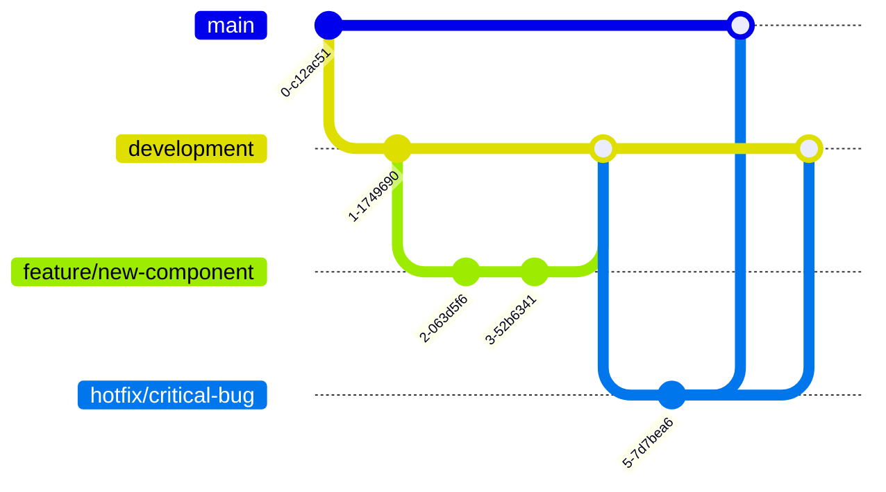

# Development Workflow and Branching Strategy

## Current Development Phases

### Phase 1: UI Updates
- [ ] Hero Section Component
- [ ] Call to Action Component
- [ ] Footer Updates
- [ ] General UI Improvements

### Phase 2: Jetstream Integration
- [ ] Team Management Setup
- [ ] API Configuration
- [ ] Authentication Updates

## Testing Requirements
- [ ] Run existing tests before creating pull requests
- [ ] Add new tests for new features
- [ ] Update tests when modifying existing functionality

## Documentation Requirements
- [ ] Update README.md with new features
- [ ] Maintain API documentation
- [ ] Update `development-plan.md` checklist

## Best Practices

### Branch Management
#### Keeping Branches Updated
```bash
# Fetch latest changes
git fetch origin

# Pull latest development branch
git pull origin development
```

#### Clean Up Branches
```bash
# Delete local branch
git branch -d feature/completed-feature

# Delete remote branch
git push origin --delete feature/completed-feature
```

### Code Review
- All features must be reviewed before merging
- Use pull requests for code review
- Address all comments before merging

### Conflict Resolution
- Resolve conflicts locally before pushing
- Communicate with team members when working on related features
- Keep feature branches small and focused

## Emergency Hotfixes

### For Critical Production Issues
```bash
# Create hotfix branch from main
git checkout main
git checkout -b hotfix/critical-issue

# After fixing, merge to both main and development
git checkout main
git merge hotfix/critical-issue
git checkout development
git merge hotfix/critical-issue
```

## Support and Questions
For questions about this branching strategy:
- Create an issue in the repository
- Contact project maintainers

## Recommended Workflow

1. **Start a New Feature**
   ```bash
   git checkout -b feature/new-feature development
   ```

2. **Commit Changes**
   - Make small, focused commits
   - Write clear commit messages

3. **Push Feature Branch**
   ```bash
   git push -u origin feature/new-feature
   ```

4. **Create Pull Request**
   - Target the `development` branch
   - Provide a clear description of changes
   - Request review from team members

5. **Code Review Process**
   - Address reviewer comments
   - Make necessary changes
   - Get approval before merging

## Git Workflow Diagram



## Additional Notes
- Always work on a feature branch
- Never commit directly to `main` or `development`
- Use meaningful branch names
- Keep branches short-lived
